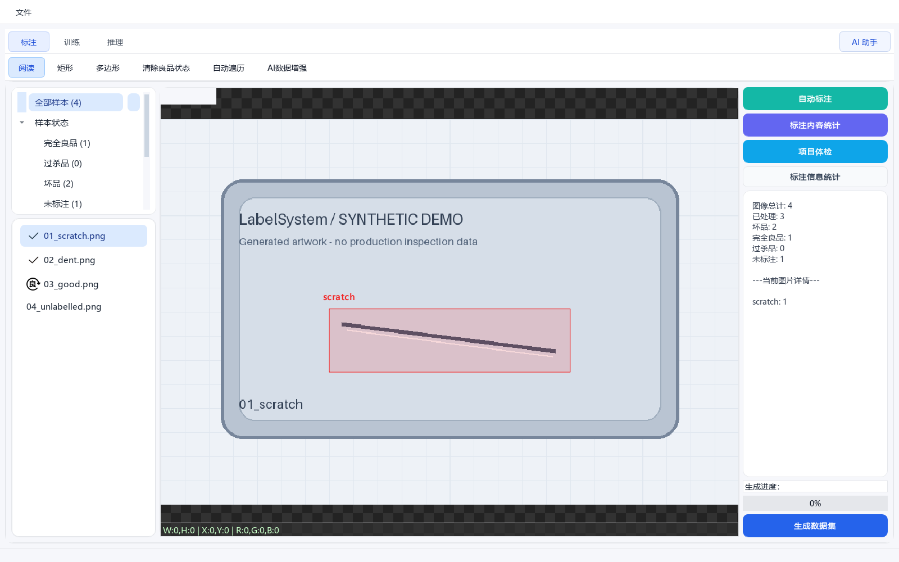
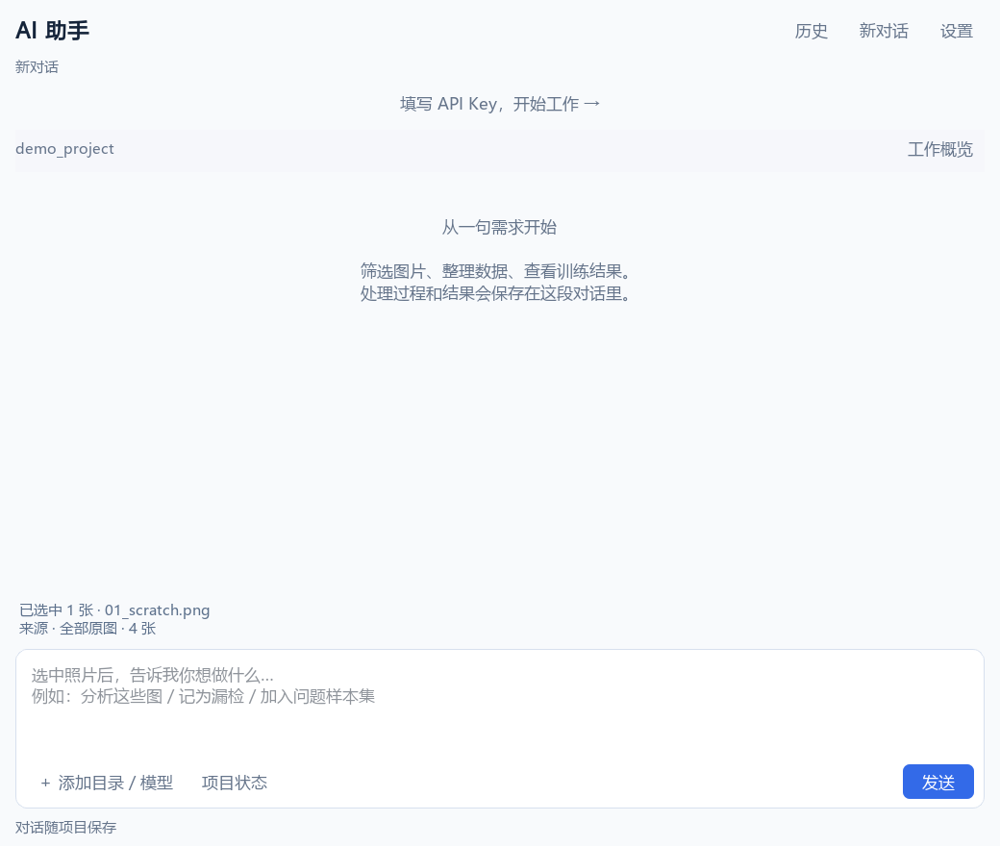

# LabelSystem

**面向缺陷检测的桌面标注与训练辅助工具，带有可调用项目功能的 AI 助手。**

LabelSystem 把图片整理、矩形/多边形标注、样本管理、YOLO 数据集导出、训练与推理放在同一个桌面工作台中。你可以使用鼠标完成标注，也可以让 AI 帮你筛选、切图、导出和分析已有结果。

[English](README.en.md) · [使用指南](docs/usage.md) · [AI 助手](docs/ai-assistant.md) · [数据格式](docs/data-format.md) · [参与贡献](CONTRIBUTING.md)



> 当前发布为源码版本，主要在 Windows 上使用和验证。仓库包含完整的现有桌面功能源码与测试；模型权重、真实样本、用户工程和 API Key 由使用者自行准备。AI 助手及新接入操作仍在持续完善。

## 适合哪些场景

主要面向**工业外观缺陷图片的离线标注、样本整理和 YOLO 模型迭代**。使用者准备自己的图片、缺陷类别与模型，软件不绑定某个客户、生产线或私有数据集。

| 场景 | 用法 |
| --- | --- |
| 给缺陷画框或轮廓 | 使用矩形标注做目标检测，使用多边形标注准备分割数据 |
| 管理良品、坏品和误判样本 | 区分未标注、完全良品、坏品和过杀品，筛选与复查样本 |
| 整理训练数据 | 导入已有标注、裁剪/切图，导出 YOLO 检测或分割数据集 |
| 迭代本地模型 | 使用自备权重训练、推理，查看结果，借助 AI 分析问题和准备下一轮数据 |

当前以单张图片及本地工程为工作单位。实时相机采集、产线设备控制、多人在线协作和独立像素级 Mask 编辑尚未接入；现有能力以本文与使用指南为准。

## 标注格式与兼容范围

**工程内的正式标注使用 JSON，一张图片对应一个 `jsons/<图片主名>.json`。** JSON 保存图片宽高、缺陷类别和矩形/多边形坐标；坐标按原图归一化到 0～1。类别字段沿用历史拼写 `lable`。

例如，图片 `sample.png` 对应 `jsons/sample.json`，其中一个矩形标注写作：

```json
{
  "image_width": 960,
  "image_height": 640,
  "annotations": [
    {
      "type": "rect",
      "lable": "scratch",
      "points": [{"x": 0.2, "y": 0.3}, {"x": 0.6, "y": 0.4}]
    }
  ]
}
```

这是为说明格式编写的虚构示例。JSON 导入面向上述结构，并兼容部分历史 `label`/`category` 字段；有效宽高已提供时，可在导入中将像素坐标归一化。LabelMe、COCO 等其他 JSON 结构需要先转换，不能仅凭 `.json` 后缀认定兼容。

训练数据导出为 **YOLO 的图片 + TXT 标签 + `data.yaml`**；也可将 YOLO 检测/分割数据导入成工程 JSON。图片清单、样本状态和子分类另有本地管理文件，不全都保存在标注 JSON 中。完整字段、状态含义和目录结构见 [数据格式说明](docs/data-format.md)。

## 开源内容与数据隐私

本仓库发布程序源码、文档、测试和程序绘制的合成示例。**不包含我们的真实业务图片、正式标注 JSON、用户工程、客户信息、模型权重、训练结果、数据库、对话历史或 API Key。** 文档截图同样来自合成工程。

基础标注与数据整理在本地进行；启用 AI 后，所配置的外部服务会收到该功能使用的对话、摘要、工具结果及必要图片，具体范围见下方 AI 说明和 [AI 助手指南](docs/ai-assistant.md)。运行时产生的私有目录、数据库和权重已在 `.gitignore` 中排除；如果你发布自己的工程或另建 Git 仓库，也应核对待提交的文件。问题反馈请使用合成或脱敏示例，避免附带原始客户数据与密钥。

## 可以做什么

| 能力 | 说明 |
| --- | --- |
| 矩形与多边形标注 | 创建、编辑、保存和重新打开缺陷标注 |
| 样本管理 | 区分未标注、坏品、完全良品和过杀品；按缺陷或子样本分类浏览 |
| 导入已有数据 | 导入匹配图片的 JSON 标注，或将 YOLO 图片/TXT/data.yaml 转为本地工程 |
| 数据集生成 | 生成 YOLO 检测或分割数据；支持良品与过杀品负样本、分类统计及训练/验证划分 |
| 图片处理 | 围绕缺陷裁剪、网格切图、连续切图、查重复和外观相似候选 |
| 本地训练与推理 | 使用自行提供的 Ultralytics `.pt` 权重；显示训练指标和预测结果 |
| 训练结果分析 | 读取 CSV、配置和统计图，解释表现、比较可比实验并提出下一轮建议 |
| AI 对话助手 | 使用自然语言组合已有工具，保存对话与产物，预览并确认正式修改 |
| 项目上下文 | 保存项目资源、已知数据/模型/结果关系和人工问题记录，跨对话继续工作 |
| 选图后继续处理 | 对选中照片看图、记问题、建立问题样本集、筛选统计导出或准备状态修改 |

## 快速开始

### 1. 获取源码

在本仓库页面点击 **Code → Download ZIP** 并解压，或使用 Git 克隆本仓库。然后进入包含 `main.py` 的目录。

### 2. 创建 Python 环境

推荐 **Python 3.11 或 3.12，64 位**。Windows PowerShell：

```powershell
python -m venv .venv
.\.venv\Scripts\python.exe -m pip install --upgrade pip
```

以下命令直接使用虚拟环境内的 Python，无需修改 PowerShell 执行策略。

### 3. 安装依赖

CPU 入门环境：

```powershell
.\.venv\Scripts\python.exe -m pip install torch==2.6.0 torchvision==0.21.0 --index-url https://download.pytorch.org/whl/cpu
.\.venv\Scripts\python.exe -m pip install -r requirements.txt
```

需要 NVIDIA GPU 时，先按 [PyTorch 官方说明](https://pytorch.org/get-started/locally/) 安装匹配环境的 PyTorch，再安装 `requirements.txt`。CPU 可用于标注、数据整理和较小规模推理，训练通常更适合 GPU。

Linux/macOS 使用 `.venv/bin/python` 替代上述 Windows 路径。跨平台桌面体验尚未逐项验收；Linux 需要可用的图形环境及 Qt 系统依赖。

### 4. 启动

```powershell
.\.venv\Scripts\python.exe main.py
```

请从仓库根目录运行。程序会自动创建本地数据库和最近工程记录。

### 5. 先体验合成示例

```powershell
.\.venv\Scripts\python.exe examples/create_demo_project.py
```

在启动窗口点击 **选择工程文件夹**，打开 `examples/demo_project`。示例有 4 张程序绘制的图片，包含矩形、多边形、良品和未标注样本；可以先体验查看、编辑与导出，无需准备真实业务图片。

## 常见工作流程

```text
新建工程 / 打开工程
    → 导入图片或已有标注
    → 标注、补标、样本归类
    → 筛选、复查、裁剪 / 切图
    → 导出 YOLO 数据集
    → 训练 / 推理
    → 分析结果并记录问题
```

基础标注和数据整理可以离线使用。训练、推理需要自备模型；首次使用某些 Ultralytics 模型名称可能触发官方权重下载。仓库不包含预训练权重或专用缺陷模型。

训练页从 `pt/` 目录发现 `.pt` 文件；推理页和 AI 助手可以选择或关联本地模型。请使用与任务、项目类别和数据来源相符的权重。

## 使用 AI 助手



点击顶部 **AI 助手 → 设置**，填写 API Key、完整的 Chat Completions 接口地址和模型名称。默认配置指向千问兼容接口；其他兼容服务需自行验证请求格式与图像支持。

可以这样说：

- “筛出有划痕的图片，统计数量。”
- “把这组图片切成 1280×1280，再导出训练数据集。”
- “分析我选中的这些照片。”
- “把这几张记为漏检，加入问题样本集。”
- “把这张改为良品。”
- “分析我添加的训练结果目录。”

正式类别或状态修改会先展示具体方案，点击确认后执行，可在符合版本校验条件时恢复。设为完全良品或过杀品会清除该照片的缺陷标注和子样本归类，请核对预览。

看图分析每批最多 **10 张源照片**；选中更多照片时分批请求。模型返回的疑点属于建议，人工问题记录需要你的明确指令。详情见 [AI 助手指南](docs/ai-assistant.md)。

AI 功能会向你配置的服务发送对话、项目摘要和工具结果；看图时会附带图片，训练分析可能附带统计图。接口可能计费。API Key 在窗口内存中使用，不随项目对话保存；使用前请确认数据适合发送到所选服务。

## 项目与导出文件

```text
你的工程/
├── images/                 # 原图
├── jsons/                  # 正式标注
├── label.txt               # 缺陷类别
├── datafile.dat             # 图片清单
├── flagfile.dat             # 样本状态
├── sample_tree.json         # 子样本分类
├── dataset/                 # 普通 YOLO 数据集
├── dataset_AI_日期_批次/     # AI 助手生成的数据集
├── exports/                 # 图片 / 标注 / 预测 / 预览导出
└── ai_workbench/             # 项目资源、对话、产物和人工记录
```

移动工程时复制完整目录。内部历史标注字段使用 `lable`，具体兼容规则见 [数据格式说明](docs/data-format.md)。

## 当前边界

- 精确画框、多边形几何编辑和独立 Mask 编辑仍通过人工界面完成。
- AI 不自动启动训练；它可以读取训练结果、比较记录和准备配置建议。
- AI 候选推理会单独保存，核对后采用；原有“自动标注”入口仍可能直接写正式 JSON，操作前请备份工程。
- 普通推理页尚未统一持久保存所有批次；AI 看图分析已有预测时依赖已保存候选结果。
- 模型选择检查与参数推荐尚不完整；当前会按项目类别过滤，未指定输入尺寸时优先沿用模型尺寸。
- 外观相似使用感知哈希候选，不能代替缺陷语义判断。
- 新的选图指令、视觉判断及部分接口调度仍需实际使用验证；本地测试通过不代表 AI 判断准确。
- 当前不提供已验证的桌面安装包，也不承诺任何模型的工业检测准确率。

## 开发与测试

```powershell
$env:QT_QPA_PLATFORM = "offscreen"
.\.venv\Scripts\python.exe -m unittest discover -s tests -v
```

测试使用合成数据和模拟 API，不需要真实 Key，不启动真实训练。首次导入会创建本地运行文件，这些文件已在 `.gitignore` 中排除。Windows 上需要符号链接权限的个别用例可能跳过。

代码组织、验证说明与提交规范见 [CONTRIBUTING.md](CONTRIBUTING.md)。

发布准备的本地测试结果与适用范围见 [验证记录](docs/validation.md)，文件边界见 [开源范围](docs/release-scope.md)。

## 许可证与依赖

本项目采用 **GNU Affero General Public License v3.0（AGPL-3.0）**，完整条款见 [LICENSE](LICENSE)。第三方组件保留各自许可证，说明见 [THIRD_PARTY_NOTICES.md](THIRD_PARTY_NOTICES.md)。

项目使用 [PyQt5](https://www.riverbankcomputing.com/software/pyqt/intro) 和 [Ultralytics](https://www.ultralytics.com/license)。模型、训练数据和外部 AI 服务的授权与使用条件需分别遵守；本仓库的许可证不替代这些组件或数据的授权。
